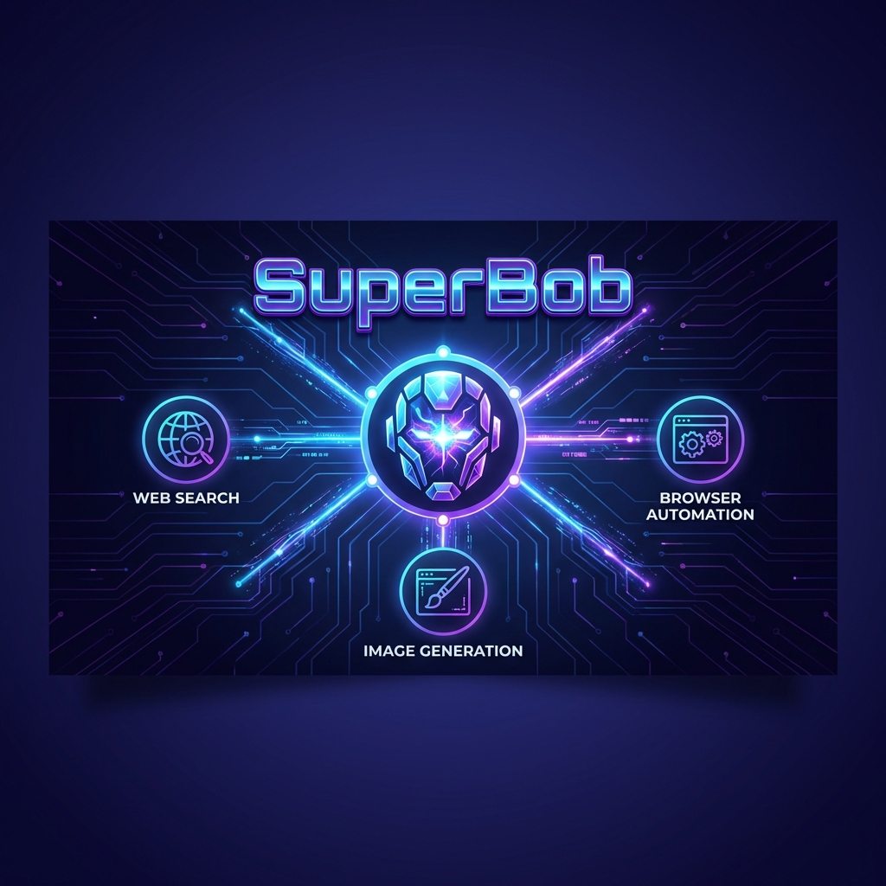

# SuperBob - The Enterprise-Ready Hero for Secure Orchestration

**Bob was just a script... until he met IBM watsonx Orchestrate. Now, effectively powered by the secure, enterprise-grade core of WXO, he has evolved into SuperBob.**

SuperBob is the **ultimate secure bridge** for enterprise automation. In a landscape of shadow IT and unmanaged bots, SuperBob stands as a vigilant guardian, ensuring that every action—from local browser automation to complex agentic workflows—is governed by the robust security standards of IBM watsonx Orchestrate.

It doesn't just "connect" to WXO; it **is** an extension of WXO's will—projecting enterprise governance, auditability, and scale into your local environment.

---

## 🛡️ Enterprise-Grade Superpowers

### 1. The WXO Core (Source of Power)
SuperBob draws its strength **exclusively** from the enterprise-hardened infrastructure of **IBM watsonx Orchestrate**.
- **Secure Authentication**: Uses rigid OAuth/API Key standards to ensure only authorized personnel can wield the power.
- **Governed Execution**: Every remote skill triggered is subject to WXO's strict access controls and policy engines.
- **Zero-Trust Architecture**: Designed to operate securely within corporate firewalls, acting as a compliant agent for local tasks.

### 2. Secure Web Telekinesis (Browser Automation)
Browser automation usually implies risk. SuperBob changes the narrative.
- **Controlled Navigation**: Automate web tasks with precision, ensuring data is extracted and handled within your secure local scope.
- **Audit-Ready Actions**: Every click and keystroke is deterministic and scriptable, removing human error from sensitive operations.

### 3. Compliant Creativity (GenAI)
 Leveraging the best-in-class AI models through secure API gateways.
- **Sanctioned Innovation**: Generate assets and insights using approved API integrations (like Gemini) without leaking IP to unknown models.

---

## 🏢 Why Enterprises Choose SuperBob

> "Before SuperBob, our scripts were rogue vigilantes. Now, they are a disciplined league of heroes."

| Feature | Competitors/Scripts | **SuperBob** |
| :--- | :--- | :--- |
| **Security** | Ad-hoc, often insecure | **Enterprise-Ready & WXO Governed** |
| **Scalability** | Breaks under pressure | **Backed by IBM Cloud Infrastructure** |
| **Integrations** | Fragile, custom code | **Native WXO Skill Ecosystem** |
| **Observability** | "It works on my machine" | **Centralized Status & Monitoring** |

---

## 🛠️ Secure Assembly (Installation)

### Prerequisites
- Python 3.10+ (The Foundation)
- **IBM watsonx Orchestrate Instance** (The Power Source - **REQUIRED**)
- Google Gemini API Key (Optional, for GenAI features)

### Installation

1. **Clone the Fortress**
   ```bash
   git clone <repo-url>
   cd SuperBob
   pip install -r requirements.txt
   pip install ibm-watsonx-orchestrate requests google-generativeai selenium webdriver-manager
   ```

2. **Establish Secure Uplink**
   Create a `.env` file. **WARNING:** Never commit this file.
   ```bash
   # IBM watsonx Orchestrate ( The REQUIRED Enterprise Core )
   WXO_INSTANCE=https://api.ap-southeast-1.dl.watson-orchestrate.ibm.com/instances/YOUR_INSTANCE_ID
   WXO_API_KEY=YOUR_BASE64_ENCODED_API_KEY

   # GenAI Extension (Optional)
   GEMINI_API_KEY=YOUR_GEMINI_API_KEY
   ```

---

## 💥 Authorized Operations (Usage)

### 1. The Official Roll Call
Lists only the agents you are authorized to see within your WXO organization.
```bash
python bob_wxo_trigger.py list
```

### 2. Enterprise Mission Deployment
Trigger a governed agent workflow.
```bash
python bob_wxo_trigger.py trigger SuperBob_2079Hm "Analyze Q3 Financials"
```

### 3. Secure Asset Generation
Generate assets locally without exposing data to public web interfaces.
```bash
python bob_wxo_trigger.py trigger SuperBob_2079Hm "Generate corporate branding assets" --no-wait
```

### 4. Enterprise Scripting (Python SDK)

SuperBob lends its powers of valid governance to your own code:

```python
from superbob.tools.browser import BrowserTool
from superbob.tools.image_gen import generate_image

# Manifest an asset securely
image_path = generate_image("A caped robot standing on a server rack")

# Deploy Governed Web Telekinesis
browser = BrowserTool()
browser.navigate("https://example.com")
browser.screenshot("mission_report.png")
```

---

## 🔧 The Toolkit

SuperBob provides a suite of tools, all designed to be orchestrated securely:

1. **web_search** - Secure external information retrieval
2. **generate_image** - Asset creation via approved APIs
3. **browser_navigate** - Headless, secure navigation
4. **trigger_wxo_agent** - The primary directive: Execute WXO skills

---

## 🔐 Security Directives

- **Credential Hygiene**: SuperBob enforces the use of environment variables for secrets. Never hardcode keys.
- **Base64 Encoding**: WXO API keys must be encoded, adding a layer of data masking during configuration.
- **Local Execution**: Sensitive browser tasks run locally on your machine, not on a third-party cloud, ensuring data sovereignty.

---

<p align="center">
  **SuperBob** — Powered by IBM watsonx Orchestrate. Uncompromising Security. Unlimted Potential.
</p>
